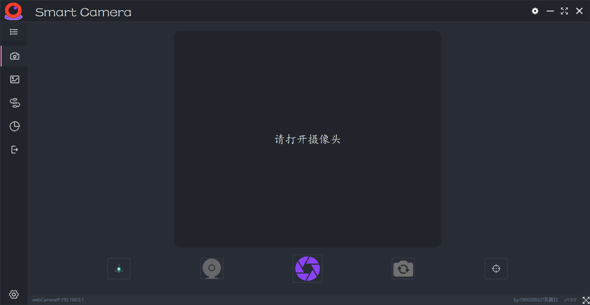

## 题目：基于图像特征点的视觉定位系统



### 题目内容

- 1.了解图像特征点提取算法以及图像处理的方法
- 2.对全局图片和局部图片进行特征点提取，比较两图中相同的特征图进行定位。
- 3.通过算法计算出局部图片相对于全局图片的水平偏移角以及垂直偏移角，误差不超过5%。
- 4.通过算法计算局部图片和水平图片的直线距离，误差不超过5%

### 环境搭建

1. 安装Anaconda环境
2. 安装依赖包（由于一些特征匹配算法在最新版opencv中受专利保护，因此安装的opencv版本为**3.4.1.15**）


```sh
conda create -n fpmatch python=3.6

conda activate fpmatch

pip3 install -r requirements.txt -i https://pypi.tuna.tsinghua.edu.cn/simple

# 安装cpu版本的PyTorch
pip3 install torch torchvision

# 安装cuda版本的PyTorch
pip3 install torch==1.9.0+cu111 torchvision==0.10.0+cu111 torchaudio==0.9.0 -f https://download.pytorch.org/whl/cu111/torch_stable.html
```


### 运行

```sh
python main.py
```

> 界面设置及一些图片储存路径设置均在`./Settings.ini`下，根据ini格式按需修改